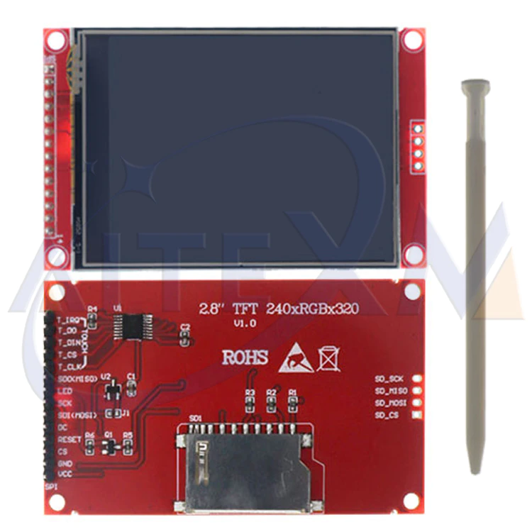

# ST7789-2.8-inch-TFT-display

A ST7789 driver I built from scratch for a 2.8-inch 240×320 TFT display, using SPI and GPIO directly on the STM32.

The main purpose of this project was to understand how an SPI-based TFT display works at a lower level and to build the driver without relying on an existing display library.

## Display



## About the Project

The ST7789 is a TFT display controller that communicates with the microcontroller over SPI.

The driver handles the basic communication required to initialize the display and draw graphics and text.

## Features

Currently, the driver supports:

- ST7789 display initialization
- SPI communication
- Display reset
- Command and data transmission
- Display control pins
- Screen filling
- Pixel drawing
- Line drawing
- Text rendering
- Basic graphics
- Display color handling
- Address window configuration

## Hardware

### Display

- 2.8-inch TFT display
- Resolution: 240 × 320
- Controller: ST7789
- Interface: SPI

### STM32

The driver was developed and tested using an STM32F407.

The STM32 communicates with the display using SPI along with GPIO control pins for CS, DC, RESET and backlight control.

## Pin Configuration

The example project uses:

| ST7789 | STM32F407 |
| ------ | --------- |
| SCK    | PB13      |
| MISO   | PB14      |
| MOSI   | PB15      |
| CS     | PD0       |
| DC     | PD1       |
| RESET  | PD2       |
| BL     | PD3       |

SPI2 is used for communication with the display.

## Example

The repository contains an example showing how to initialize the display and use the driver.

The example demonstrates:

- Initializing the STM32 clock
- Configuring SPI
- Configuring the ST7789 control pins
- Initializing the display
- Filling the screen
- Displaying text
- Drawing basic graphics

## Project Structure

```text
ST7789-2.8-inch-TFT-display/
│
├── Inc/
│   └── ST7789.h
│
├── Src/
│   └── ST7789.c
│
├── example.c
│
├── ST7789_DISPLAY.jpg
│
└── README.md
